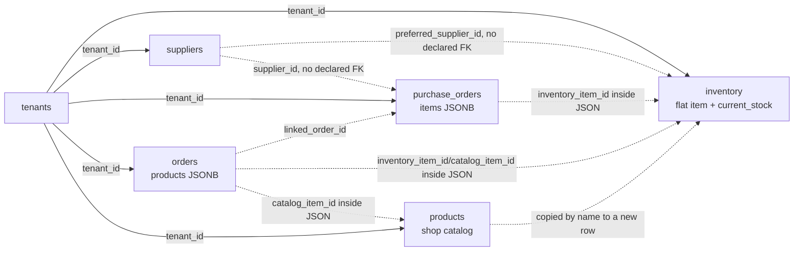

# OPPS Inventory System Audit and Redesign Plan

**Audit date:** 2026-07-26  
**Repository baseline:** `daba509` (`main`)  
**Scope:** Repository and migration audit only. No production records were changed and no inventory redesign was implemented.

## Audit basis and limitations

This audit traces the checked-in React application, Supabase schema/migrations, existing SQL tests, repository history, and the inventory behaviour described in the supplied brief. It does not claim live production row counts. The repository contains only public client credentials and no authenticated audit session or local Supabase project configuration, so a tenant-authorized, read-only production data extract was not available. Section 9 provides audit-only SQL for a human-reviewed production report before any migration.

The repository is the source for every architectural conclusion below. Record examples from the brief (for example, inconsistent Daniel Slaves names) are treated as hypotheses to test, not as independently verified database facts.

## 1. Executive summary

OPPS currently has a usable flat stock register, not an inventory control system. The `inventory` table stores one row identity, one `current_stock` balance, optional string arrays for sizes/colours, one free-text location, prices, a supplier ID, and reorder settings (`src/api/supabase/schema.sql:221-264`). `Inventory.jsx` lists those rows directly, lets a user overwrite the balance in the same create/edit form, and marks a row low when `current_stock <= reorder_point` (`src/pages/Inventory.jsx:283-318`, `548-550`, `672`, `775-778`). New rows start with a UI default reorder point of 10 (`src/pages/Inventory.jsx:283-286`), which directly explains the reported alert flood for small variant balances.

The current design is confusing because a row has to carry product, variant, balance, replenishment, supplier, location, and pricing responsibilities at once. It cannot represent a product with many colour/size variants without displaying each combination as an unrelated item. More importantly, the balance is not trustworthy under real operations: there is no movement ledger, reservation record, receiving transaction, picking/issue workflow, return, damage state, count session, transfer, or atomic stock RPC anywhere in the checked-in schema or application.

Orders can reference an inventory row through `inventory_item_id` inside the order `products` JSON, but order creation merely writes the JSON (`src/api/dataClient.js:163-246`; `src/components/orders/NewOrderDrawer.jsx:376-391`). Purchase-order lines can likewise carry an `inventory_item_id`, but “Mark Received” only updates `purchase_orders.status` (`src/pages/PurchaseOrders.jsx:87-94`, `144-146`; `src/components/purchaseorders/POModal.jsx:127-135`). These are selection conveniences, not stock integrations. This creates high risks of double allocation, missed receipts, silent balance overwrites, and stock decisions based on heuristic name matching.

The recommended direction is a small apparel-oriented inventory domain beside the existing storefront catalog:

- product and colour/size variant masters;
- structured locations and per-variant/location balances;
- an append-only movement ledger as the accounting source;
- explicit reservations linked to order lines;
- guided receipts, picks/issues, production returns, losses, counts, and transfers;
- atomic, tenant-scoped database RPCs with idempotency and row locking;
- optional mappings from catalog offerings/order lines to the physical variants they consume.

Do not repurpose broad `orders.status` values for this. Add stock status/reservation records and surface stock blockers alongside the protected `pipeline_stage` and production-detail workflow.

### Highest business risks

1. **Critical — storefront order requests are not persisted by the configured data client.** `ClientCatalog.jsx` calls `dataClient.entities.ClientOrder.create` (`src/pages/ClientCatalog.jsx:201-203`, `385-412`), but `ClientOrder` has no `ENTITY_CONFIG` entry. Unsupported entities fall back to an in-memory local collection (`src/api/dataClient.js:1780-1834`, `1836-1891`). A successful-looking request can therefore disappear on reload and cannot reserve stock.
2. **High — no reservation or atomic availability enforcement.** Two orders can reference the same last unit because order writes do not lock/check/update inventory.
3. **High — no movement audit trail.** Direct `current_stock` edits erase the reason, actor, related order/PO, and prior balance.
4. **High — receiving is only a PO status change.** Marking a PO received does not increase stock, record shortages/damage, or prevent duplicate receipt.
5. **High — catalog administration has a tenant-context defect.** `products` is tenant-scoped in the database, but `CatalogItem` is not marked `tenantScoped` in `dataClient.js` (`src/api/dataClient.js:1356-1408`). Regular member writes may fail RLS because no `tenant_id` is sent, while app admins are allowed by policy to read/write across tenants (`supabase/migrations/202606270008_tenant_storefront_catalog_backend.sql:123-137`).
6. **Medium — the page silently truncates inventory.** It requests at most 200 rows and performs all searching/filtering in the browser (`src/pages/Inventory.jsx:548-550`, `655-672`), with no pagination indicator.

## 2. Current architecture

### Frontend routes and components

| Area | Current implementation | Evidence and consequence |
| --- | --- | --- |
| Internal inventory | Lazy page `Inventory`; sidebar entry “Inventory” | `src/pages.config.js:68,116`; `src/Layout.jsx:42` |
| Stock list and modal | `src/pages/Inventory.jsx`; `ItemFormModal` is inline | Create/edit share product identity, balance, reorder, price, supplier, and location (`Inventory.jsx:283-405`). |
| Catalog tab inside Inventory | Inline `CatalogItemFormModal`, catalog grid/list, “Add to stock” | Catalog row is copied into a new flat inventory row with `current_stock: 0`; linkage is by lower-cased name only (`Inventory.jsx:575-583`, `641-650`, `674`). |
| Older catalog admin | `src/pages/CatalogManagement.jsx` | A second writer for the same `products` table exists (`CatalogManagement.jsx:23-49`) but is not in the sidebar. It uses overlapping but different fields and presentation. |
| Public catalog | `src/pages/ClientCatalog.jsx` | Reads the tenant catalog through host-scoped RPCs (`ClientCatalog.jsx:150-170`), but creates an unsupported `ClientOrder` entity (`201-203`). |
| Purchase orders | `src/pages/PurchaseOrders.jsx`, `TypeformPOForm`, `POModal`, `StockDemandPanel` | PO items can point at inventory/catalog. Receipt action changes status only. Demand analysis uses name heuristics rather than variant IDs (`StockDemandPanel.jsx:6-94`). |
| Order product selection | `NewOrderDrawer`, `ProductsEditor` | Inventory/catalog picker stores `inventory_item_id` or `catalog_item_id` inside JSON product rows (`NewOrderDrawer.jsx:748-809`; `ProductsEditor.jsx:416-488`). |
| Other inventory consumers | Calculator, invoice line editor, notifications, archive | These read flat rows/costs; none posts stock movements (`src/pages/Calculator.jsx:47-87`; `src/features/invoices/InvoiceLineItemsEditor.jsx:160-227`; `src/components/common/NotificationsPanel.jsx:16-26`; `src/pages/Archive.jsx:42-44,179-180`). |

### Read path

`Inventory.jsx` calls `InventoryItem.list("name", 200)` (`src/pages/Inventory.jsx:548-550`). The entity maps to `public.inventory`, is marked `tenantScoped`, selects `*`, adds `tenant_id = getCurrentTenantId()` when available, sorts, and applies the limit (`src/api/dataClient.js:347-385`, `1639-1685`). React Query caches the result under the broad key `['inventory']`.

There are no joins in the inventory query. Suppliers are fetched separately (limit 100) and mapped client-side (`src/pages/Inventory.jsx:553-557`, `652`). This is two bounded queries rather than an N+1 query, but missing supplier rows or records beyond the cap display as no supplier.

### Add/edit mutation trace

1. `ItemFormModal` initializes a new row from `EMPTY_FORM`, including `current_stock: 0` and `reorder_point: 10` (`src/pages/Inventory.jsx:283-292`).
2. Submit validates only the trimmed name and converts inputs with `Number(...)`; zero reorder values become `null` because of `Number(value) || null` (`Inventory.jsx:305-321`). Negative quantities/prices are not rejected.
3. The modal calls `InventoryItem.create` or `.update` (`Inventory.jsx:294-299`).
4. `InventoryItem.serialize` maps directly to the flat database columns, including `current_stock`, and omits any actor/reason/version (`src/api/dataClient.js:365-383`).
5. Generic insert/update adds/filters by the current tenant in the frontend and executes a single Supabase row write (`dataClient.js:1696-1753`). There is no transaction, balance comparison, movement record, or optimistic version check.
6. React Query invalidates `['inventory']` after success (`Inventory.jsx:300-303`).

### Low-stock trace

The inventory page and notification panel use the same rule: active row + non-null reorder point + `current_stock <= reorder_point` (`src/pages/Inventory.jsx:672,777`; `src/components/common/NotificationsPanel.jsx:16-26`). The Inventory page then joins every matching name into a red paragraph (`Inventory.jsx:738-746`). The dashboard `LowStockAlert` computes a percentage against the same two fields (`src/components/dashboard/LowStockAlert.jsx:7-8`).

The default of 10 is set in the frontend, not the database. A newly created small variant with stock 0-10 is therefore immediately low. The rule ignores reservations, incoming quantities, lead time, velocity, target level, or whether the row is a stocked item at all.

### Supabase tables, migrations, views, RPCs, triggers, and RLS

| Object | Current state |
| --- | --- |
| `inventory` | Created in `src/api/supabase/schema.sql:221-264`; flat row with globally unique nullable `sku`, one `current_stock`, optional arrays, prices, supplier UUID without a declared FK, and free-text `location`. |
| `suppliers` | Creation DDL is absent from checked-in migrations; `202605260002_supplier_products.sql` assumes it exists and adds a JSONB `products` catalog. This is schema-history drift. |
| `purchase_orders` | JSONB `items`, dates/status/totals, optional un-enforced UUID links (`supabase/migrations/202605180002_create_purchase_orders_table.sql:1-39`). No receipt lines or quantities received. |
| `products` | Storefront catalog master, not an inventory product master (`202605150001_create_products_table.sql:1-14`; store fields added by `202605220003_extend_products_store_options.sql`). |
| Orders/order items | `orders.products` is JSONB, documented as `{name, quantity, price, size, color}` (`src/api/supabase/schema.sql:77-99`). There is no normalized order-line table or FK to inventory variants. |
| Inventory views/RPCs | None found. No reserve, release, receive, issue, return, adjust, count, or transfer RPC exists. |
| Inventory triggers | Timestamp trigger plus tenant-assignment trigger only (`schema.sql:266-268`; `202606210004_tenant_purchasing_inventory.sql:21-30`). |
| Inventory RLS | `tenant_manage_inventory` uses `can_access_tenant(tenant_id)` for all authenticated operations (`202606210004_tenant_purchasing_inventory.sql:21-30`). The earlier PO-wide policy is removed at line 33. |
| Catalog RLS | Host-scoped public reads use `get_storefront_catalog_for_host`; direct public product policy was removed. Authenticated catalog management allows membership or app-admin bypass (`202606270008_tenant_storefront_catalog_backend.sql:25-137`). |
| Tests | Storefront host/catalog isolation has SQL probes. No checked-in inventory ledger, reservation, receipt, count, concurrency, or inventory-specific RLS SQL test exists. |

### Recent relevant history

- `4916490` — tenant-scope purchasing and inventory.
- `9ec5345` — fix tenant purchasing trigger.
- `0aea23d` — private uploads; relevant to future damage/receipt evidence.
- `202606270008_tenant_storefront_catalog_backend.sql` — latest catalog RLS/RPC boundary.
- `202607020001_opps_invoice_item_templates.sql` — nullable `inventory_item_id` metadata, but no FK or inventory mutation.

The older `files/OPPS_v3_Addendum.md:563-715` proposed supplier/variant fields and automatic decrement-on-payment, but those DDL fields and trigger are not present in migrations or `InventoryItem.serialize`. Treat that section as unimplemented legacy design, not current behaviour. Its direct decrement proposal should not be revived; reservation plus movement posting is safer.

## 3. Current data model



What is absent is as important as what exists: there is no variant table, location table, balance by location, movement/transaction table, reservation, receipt/receipt line, count session/line, transfer, normalized order item, or purchase-order line table.

The current `sizes_available` and `colors_available` arrays describe possible attributes on one row; they do not create identifiable variants or per-combination balances. In practice the reported flat colour/size names are the only way to distinguish combinations, which explains the long list.

## Internal Product Naming and Supplier Product Mapping

### Current limitation

The current `inventory.name` is overloaded: it may represent an internal garment name, the supplier's product name, specifications such as GSM, and variant text such as colour/size. `preferred_supplier_id` identifies at most one supplier and the current schema has no supplier-product entity (`src/api/supabase/schema.sql:224-255`). The supplier page's `products` field is an unstructured JSONB list (`supabase/migrations/202605260002_supplier_products.sql:1-5`), so it cannot safely identify the exact physical SKU received, reserved, picked, returned, or damaged.

### Joint X naming requirement

OPPS should preserve three distinct identities:

1. **Internal product / garment class:** the stable Joint X identity used by staff and workflows, for example `JET - Joint X Essential Tee`.
2. **Supplier product:** the exact commercial product offered by a supplier, for example `Daniel Slaves 220gsm Tee` with supplier code `DS-220`.
3. **Physical supplier variant:** the exact colour/size item received, for example Daniel Slaves `Black / XL`, supplier SKU `DS-220-BLK-XL`, received on PO-104.

A fourth, optional name belongs to the Shop Catalog: a customer-facing offering such as `Premium 220gsm Blank Tee`. It must map to the internal product but must not overwrite either the internal or supplier identity.

`JET` should therefore be a stable, tenant-scoped Joint X internal code, not an alias that replaces `Daniel Slaves 220gsm Tee`. Supplier discontinuation or an approved alternative should not require renaming existing orders/templates, while historical movements must continue to identify what was actually bought and used.

### Recommended relationship and data model

Use a four-level identity model:

```text
Internal product / garment class
  JET - Joint X Essential Tee
    `-- Internal variant requested by orders
        Black / XL - internal SKU JET-BLK-XL
          |-- Daniel Slaves 220gsm Tee / Black / XL - DS-220-BLK-XL
          `-- Approved Supplier B 220gsm Tee / Black / XL - supplier-specific SKU
```

The safest and least confusing design is for **internal variants to belong directly to the internal product**, with supplier variants linked separately to the internal variant. Compared with making `inventory_variants` children of supplier products, this gives orders/catalog mappings one stable `JET / Black / XL` requirement while preserving multiple exact fulfillment candidates. Physical balances, receipts, allocations, movements, costs, returns, and damage must be recorded against the exact supplier variant, not pooled only at `JET` level.

Recommended objects:

- `inventory_products`: `tenant_id`, `internal_code`, `internal_short_name`, `internal_name`, `internal_description`, category, garment type, `weight_gsm`, fit, material, neck style, sleeve type, gender/cut where needed, brand/manufacturer classification, default print/embroidery compatibility, customer-facing default where appropriate, active/version fields.
- `inventory_variants`: canonical internal colour/size combination, `internal_sku`, barcode if Joint X labels it, active state. FK to `inventory_products`.
- `inventory_supplier_products`: FK to internal product and supplier; official supplier name/code/description/reference URL, lead time, default/approved-substitute flags, specification comparison, approval status and effective dates.
- `inventory_supplier_variants`: FK to both supplier product and compatible internal variant; official colour/size names, supplier SKU/barcode, cost and active state.
- `inventory_balances` and operational records: reference `inventory_supplier_variant_id` and location, so quantity remains attributable to the exact sourced garment. Internal-product totals are derived groupings.

Do not mark a supplier product interchangeable merely because it maps to `JET`. Record substitution status such as `exact`, `approved_substitute`, `conditional`, or `not_approved`, plus reviewer, date, notes, and optionally specification differences. A changed GSM, cut, material, shade, neck or print behaviour may require `JET V2` or a different internal class instead of a substitute link.

### JET example

```text
Internal code: JET
Internal name: Joint X Essential Tee
Internal description: Standard 220gsm blank tee used for Joint X production
Garment type: T-shirt
Weight: 220gsm
Fit: Standard
Material: Cotton

Supplier: Daniel Slaves
Supplier product: Daniel Slaves 220gsm Tee
Supplier product code: DS-220

Internal variant: Black / XL
Internal SKU: JET-BLK-XL
Supplier variant: Daniel Slaves Black / XL
Supplier SKU: DS-220-BLK-XL
```

Recommended displays:

- Internal operations: `JET - Black / XL` with `Daniel Slaves 220gsm Tee` as secondary text after allocation.
- Receiving/purchasing: `JET - Black / XL` followed by `Daniel Slaves 220gsm Tee / DS-220-BLK-XL`.
- Production: `JET` followed by `Black / XL / 220gsm`; show supplier identity when quality, substitution, or traceability matters.
- Supplier PO: lead with `Daniel Slaves 220gsm Tee`, `Black / XL`, and supplier SKU.
- Catalog/customer documents: use the approved customer-facing name; hide supplier brand unless the product promise or owner policy requires it.

### Multiple suppliers and substitution

One internal product may have multiple supplier products, but they are candidates rather than one pooled identity. The internal matrix can aggregate quantities for planning, while each cell must allow drill-down by exact supplier product. Allocation chooses a specific supplier variant and records whether it is the default or an approved substitution. OPPS must never silently replace Daniel Slaves stock with another supplier because both map to `JET`.

If mixed supplier garments are allowed within an order, allocations must retain supplier variant per order-line quantity and the pick screen must show the mix. If mixing is prohibited, the allocation RPC should enforce a single supplier product for the relevant order/product scope unless an authorized substitution approval is recorded.

### Search and SKU behaviour

Tenant-scoped search should index normalized internal and supplier identities. A search for `JET`, `Joint X Essential Tee`, `Daniel Slaves`, `Daniel Slaves 220gsm`, `DS-220`, `220gsm`, `JET-BLK-XL`, `DS-220-BLK-XL`, `Black`, or `XL` should find the same hierarchy and clearly label which field matched.

- `internal_code` is short, stable, unique within a tenant, easy to say/search, and excludes colour/size. The same code may exist in another tenant only if tenant-scoped uniqueness is approved.
- `internal_sku` is Joint X-owned and may follow `internal_code + colour code + size`, for example `JET-BLK-XL`.
- `supplier_sku` remains supplier-owned and must never be overwritten by the internal SKU.
- Search indexes should include `(tenant_id, lower(internal_code))`, normalized internal name/specifications, supplier ID/name/product code, and both SKU fields; exact SKU/barcode matches should rank first.

### Receiving and physical stock

Purchase-order and receipt lines must select the exact supplier product/variant. Receipt confirmation posts quantity, cost, supplier, PO, receipt reference, and location against `inventory_supplier_variant_id`. The internal `JET / Black / XL` balance shown to staff is a derived total across eligible supplier variants, with a breakdown always available. If batch-level provenance is needed for different receipts/costs, add receipt-line/stock-lot allocation rather than collapsing the history.

### Order request and allocation

An order initially reserves demand against `JET / Black / XL` using `requested_inventory_variant_id`; this is an internal requirement, not yet a physical-stock hold. Before picking, fulfillment must allocate the required quantity to one or more exact `inventory_supplier_variant_id` records. That allocation creates the hard reservation against the selected supplier-variant/location balance. Picking is prohibited without an exact allocation, and multiple supplier garments may fulfill one production run only through an explicit approved exception. Reservations, allocations, and movements must retain both the requested internal variant and allocated supplier variant, substitution/mixing approval, actual unit cost, and source receipt/lot where required. Cost and profit reporting use the exact allocated supplier variant.

### Catalog naming

Retain `products.name` as the customer-facing catalog name. Link the catalog product/component to an internal product or internal variant. Do not copy catalog names into physical inventory, and do not expose supplier names, costs, SKUs or internal mappings through the public host-scoped catalog RPC unless explicitly approved.

### Legacy migration implications

Legacy mapping must retain the original `inventory.name`, SKU and row ID verbatim. Generate suggestions rather than automatic assignments:

| Existing record | Suggested internal product | Suggested supplier product | Confidence | Review status |
| --- | --- | --- | ---: | --- |
| Daniel Slaves 220gms Tees | JET | Daniel Slaves 220gsm Tee | High | Pending |
| Daniel Slaves 300gms | Unknown | Daniel Slaves 300gsm Tee | Medium | Pending |
| Unspecified 180gms Tees | Unknown | Unknown supplier 180gsm Tee | Low | Pending |

Review actions must support confirm, reject, link to another internal product, create a new internal product, create/link the supplier product, and defer. Do not assign every Daniel Slaves tee to `JET`: GSM, style, cut, material, colour naming and supplier references must agree, and ambiguity must remain pending. The approved mapping should preserve reviewer, timestamp, source evidence and original text.

## 4. Findings

| ID | Severity | Description and evidence | Operational / technical impact | Recommended correction |
| --- | --- | --- | --- | --- |
| INV-01 | Critical | Public catalog submits `ClientOrder`, which has no configured remote entity (`ClientCatalog.jsx:201-203`; no `ClientOrder` in `dataClient.js`). Generic fallback is memory-local (`dataClient.js:1780-1891`). | Order request may appear successful then disappear; no stock reservation or auditable source exists. | Route storefront submission through the existing tenant/host-aware request RPC or add a secured, configured entity/RPC with idempotency. Test persistence before inventory integration. |
| INV-02 | High | One mutable `current_stock` is the only balance (`schema.sql:237-243`); UI overwrites it directly (`Inventory.jsx:305-318`). | No explanation for a balance, fraud/error detection, reconstruction, approval, or safe rollback. | Add append-only movements and post every balance change through atomic RPCs. Lock direct balance writes after backfill. |
| INV-03 | High | No reservation tables/RPCs/triggers; orders only store JSON references (`dataClient.js:193-214`). | Double allocation and negative availability are possible; cancellation cannot reliably release stock. | Add reservation state machine and atomic `reserve/release` RPCs keyed to stable order lines. |
| INV-04 | High | “Mark Received” updates only PO status (`PurchaseOrders.jsx:144-146`; `POModal.jsx:132-135`). | PO may say received while inventory remains unchanged; partial/missing/damaged receipt and duplicate receipt cannot be controlled. | Add receipts/lines and one confirm-receipt RPC that posts idempotent movements and updates receipt/PO state. |
| INV-05 | High | Product/variant concepts are mixed in flat rows; size/colour are arrays or embedded in text (`schema.sql:224-247`). | Long lists, duplicate product naming, ambiguous SKU ownership, no matrix operations. | Introduce `inventory_products` and `inventory_variants`; migrate each legacy row to a proposed product/variant mapping with human review. |
| INV-06 | High | `CatalogItem` omits `tenantScoped` (`dataClient.js:1356-1408`) while products RLS requires a tenant unless app admin bypasses (`202606270008...sql:132-137`). | Member catalog writes can fail; an app admin can list/write across tenants, and a null-tenant write can become invisible to storefront RPCs. | Mark the entity tenant-scoped, make `products.tenant_id` non-null after cleanup, explicitly scope admin UI queries, and retain host-scoped public RPCs. |
| INV-07 | High | `inventory.tenant_id` is added nullable and never made `NOT NULL`; service role bypasses RLS by platform design. Tenant trigger only derives from supplier when present (`202606210004...sql:3-37`). | Service/admin code can create orphan/null or wrong-tenant stock unless it explicitly stamps and validates tenant. | Make tenant ownership non-null after audit; require tenant in every security-definer/service operation; validate all parents; test service paths separately. |
| INV-08 | High | `sku text unique` is global (`schema.sql:225-227`) rather than tenant-aware. | Tenants can block one another from using the same supplier/common SKU; null remains unconstrained. | Replace with a partial unique index on `(tenant_id, lower(sku)) where sku is not null and active`, at the variant level. |
| INV-09 | High | Supplier/PO/inventory UUID relationships largely lack declared FKs; supplier creation DDL is absent. PO/order line links live inside JSON. | Orphans and invalid cross-object IDs are possible; cascade semantics and schema reproducibility are unclear. | Baseline the actual remote schema, add tenant-aware parent guards/FKs where possible, and normalize operational lines. |
| INV-10 | Medium | New items default to reorder 10; low means `current_stock <= reorder_point` (`Inventory.jsx:285,672`). | Nearly all small variants alert; warning fatigue hides genuine shortages. | Default minimum to null/0, distinguish out/low/over-reserved, and evaluate available plus incoming against configured min/target. Do not bulk-change existing values without review. |
| INV-11 | Medium | Low-stock alert renders every item name in one paragraph (`Inventory.jsx:738-746`). | Unscannable on mobile and large tenants; potentially expensive DOM/text. | Show counts and drill-down filters; never concatenate the complete list. |
| INV-12 | Medium | Inventory fetch is capped at 200; catalog at 500; search/filter/sort are client-side (`Inventory.jsx:548-563,655-672`). | Rows beyond the cap are silently absent; totals and warnings can be wrong. | Server-side filter/sort, cursor pagination, aggregate RPC/view for cards, and virtualization only for an expanded matrix/list. |
| INV-13 | Medium | `StockDemandPanel` reads legacy `blank_type` and uses fuzzy names, while current orders primarily store product JSON (`StockDemandPanel.jsx:10-30,47-65`). | False matches/missed demand; “available after orders” is not a reservation balance. | Replace with stable order-line-to-variant mappings and reservation/incoming queries. Label heuristic panel as estimate until retired. |
| INV-14 | Medium | Two internal catalog writers exist: Inventory tab and `CatalogManagement.jsx`, with different forms/limits and duplicated dedupe logic also in `ClientCatalog.jsx`. | Behaviour drifts; name-based dedupe hides duplicates rather than resolving them. | Choose one catalog admin route and shared product editor/service. Keep catalog separate from inventory operations. |
| INV-15 | Medium | “Add to stock” compares/copies by lower-cased product name (`Inventory.jsx:575-583,641-650`). | Renames and duplicates break linkage; catalog offering cannot express multiple consumed variants. | Replace with explicit catalog-to-inventory consumption mappings. |
| INV-16 | Medium | Generic reads return cached rows on Supabase error (`dataClient.js:1676-1685`), and local fallback exists for unsupported operations. | Stale inventory can look current unless UI exposes offline/error state. | For stock truth, fail closed on remote errors, display “last synced/read-only,” and never accept offline balance overwrites. |
| INV-17 | Medium | Generic create queue has no idempotency key (`offlineQueue.js:26-67`), though inventory does not currently use it. | Reusing it for movements would duplicate receipts/issues after uncertain retries. | Build an inventory-specific queue with UUID idempotency key, tenant, device, occurred-at, submitted-at, and reconciliation state. |
| INV-18 | Low | Units are always plural labels; UI can show `1 pieces` (`Inventory.jsx:792,815`). Inputs use visual labels but do not consistently bind `htmlFor`/IDs. | Polish and accessibility defects; low operational risk. | Add unit formatter and properly associated labels during safe UI cleanup. |

## 5. Real-world workflow gap analysis

| Workflow | Current support | Gap / risk |
| --- | --- | --- |
| Create product | Flat inventory item; separate storefront `products` create forms | Physical product identity and sales offering are conflated; duplicate admin paths. |
| Create variants | None. Possible arrays/text in one row | No stable colour/size cell, variant SKU, barcode, active flag, or matrix generation. |
| Supplier receiving | PO can be marked received | No receipt document, per-line received/missing/damaged quantities, location, reference, evidence, movement, or duplicate protection. |
| Order reservation | Inventory row can be selected on an order | No availability check, reservation, partial status, release, or locking. Double allocation is possible. |
| Picking | None | No pick list/scanning/confirmed picked quantity or exception. |
| Issue to production | None | No issued state or movement. Keep this separate from broad order status and connect it to production detail stages later. |
| Production return | None | Users can only manually increase stock, losing order/reason/condition. |
| Damage/misprint/missing | None | No reason taxonomy, evidence, approval, or unusable balance. |
| Transfer | Free-text location can be edited | Editing location moves the whole conceptual row without source/destination movement or per-location balances. |
| Stock count | None | No snapshot, blind count, variance review, approval, or adjustment movement. |
| Procurement | PO JSON lines, supplier JSON product catalogs, heuristic demand panel | No normalized PO lines, incoming balance by variant, receipt reconciliation, or robust demand link. |
| Reordering | Flat threshold and optional quantity | Ignores available, incoming, reservations, lead time, usage, target, and configuration validity. |
| Shop availability | `products.store_visible` controls listing | No connection between listing and physical availability; storefront presents “Stock Ready” statically (`ClientCatalog.jsx:879`) without checking inventory. |

## 6. Recommended target architecture

### Domain boundary

Keep three concepts explicit:

1. **Inventory product/variant:** the physical blank, finished item, material, label, packaging unit, etc. that can be counted.
2. **Catalog product:** what a customer can configure/buy. Retain `products` for this.
3. **Consumption mapping:** what physical variants/materials a catalog/order line requires. A catalog product may be made on demand, untracked, or map to one or several inventory variants.

Use separate internal routes (`/Inventory` and a single catalog-management route) even if they share navigation context. Do not keep catalog editing as an operational Stock tab long-term. Public storefront reads must continue through the host-scoped RPC.

### Stock accounting model

- `on_hand` is the usable physical balance at a location.
- Internal demand reservation records what the order requested; it does not directly reduce a physical balance.
- `reserved` on a balance is the hard allocation of an exact supplier variant/location to an order line and must not exceed policy unless explicitly approved.
- `available = on_hand - reserved` is derived, never independently edited.
- `incoming` is derived from confirmed PO/transfer quantities less received/cancelled quantities.
- Damaged/quarantine/inspection stock belongs in non-available location/status buckets or explicit balance buckets; do not mix it into usable on-hand.
- Issuing a garment to production posts an on-hand decrease and moves the reservation through `reserved -> picked -> issued`. Whether it enters a production-WIP balance is an owner decision.
- The immutable movement ledger is the accounting source. `inventory_balances` is a transactionally maintained projection/cache for fast reads.

### Command/query split without over-engineering

Reads can use tenant-scoped views/RPCs returning grouped product totals and matrix cells. Writes must use a small set of database commands: receive, reserve, release, pick/issue, return, adjust, transfer, and approve count. Each command:

1. resolves tenant from authenticated membership/server context;
2. validates all parent records share the tenant;
3. locks affected balance/reservation rows in a consistent order;
4. checks state and non-negative/over-reservation policy;
5. appends movements and updates balances in one transaction;
6. records actor, reason, references, and an idempotency key;
7. returns resulting balances and business status.

### Permissions

- Viewer: read balances/movements.
- Operator: draft/confirm receipts, picks, returns, transfers, and counts within assigned locations.
- Supervisor: approve variances/losses above configured thresholds and controlled over-reservation.
- Admin: configure products/variants/locations/reorder policies; still explicitly tenant-scoped.
- Service role: only narrowly scoped functions with required tenant/source/idempotency validation. Never expose service credentials to the browser.

## 7. Proposed database changes

Names below fit the existing schema but remain proposals. Create additively; do not rename/drop `inventory` in the first migration.

| Table / object | Purpose and core fields | Tenant, constraints, indexes, RLS, migration notes |
| --- | --- | --- |
| `inventory_products` | Joint X internal garment identity: `id`, `tenant_id`, `internal_code`, `internal_short_name`, `internal_name`, description, category, garment type, `weight_gsm`, fit, material, neck/sleeve/cut, compatibility, active/version fields. | `tenant_id NOT NULL`; unique `(tenant_id, lower(internal_code))`; indexes category/specifications/name. Stable across supplier changes; tenant membership RLS and no public reads. |
| `inventory_variants` | Canonical internal requirement: `product_id`, normalized colour/size, `internal_sku`, internal barcode, reorder policy, active state, legacy mapping. | Unique `(tenant_id,lower(internal_sku))` and product/normalized colour/size when active. Orders/catalog target this stable variant; it does not prove what supplier stock was used. |
| `inventory_supplier_products` | Exact supplier offering: internal product, supplier, official product name/code/description/URL, lead time, default flag, substitution status/approval, specification comparison, effective dates, active state. | Tenant parent guards; unique supplier/product code as appropriate; indexes internal product, supplier, official code and approval state. One internal product may have several non-interchangeable supplier products. |
| `inventory_supplier_variants` | Exact supplied colour/size SKU: supplier product, compatible internal variant, supplier colour/size names, supplier SKU/barcode, cost, active state. | Tenant-aware supplier SKU uniqueness and parent guards. Balances, receipts, allocations and movements reference this exact variant. |
| `inventory_locations` | Structured hierarchy: `name`, `code`, `type`, `parent_id`, `path`, `allows_usable_stock`, `is_active`. | Tenant-scoped self-parent guard; unique `(tenant_id,lower(code))`; prevent cycles in RPC/trigger; index parent/type. Include receiving, production, damage/quarantine locations without building a full WMS. |
| `inventory_balances` | Fast projection per exact supplier variant/location: `on_hand`, `reserved`, `version`, `updated_at`; internal variant/product totals are derived. | PK/unique `(tenant_id,supplier_variant_id,location_id)`; non-negative checks unless a controlled exception policy is chosen; browser writes denied and only command functions update it. `available` is derived. |
| `inventory_movements` | Append-only evidence: requested internal variant, exact supplier variant, `movement_type`, quantity, source/destination locations, actor/reason, order line, substitution approval, actual cost, PO/receipt/transfer/count refs, idempotency and balance snapshots. | Quantity is positive; direction comes from type/locations; server-written; indexes by supplier variant/time, requested variant/order, PO and reference. |
| `inventory_reservations` / `inventory_allocations` | Requirement state begins against the requested internal variant; allocation rows then select exact supplier variants/locations before picking, with substitution and mixed-supplier approvals, requested/allocated/picked/issued/released quantities, status, expiry and timestamps. | Internal demand does not mutate a physical balance. Exact allocation atomically reserves the supplier-variant/location balance. Protected transitions prohibit picking unallocated quantity. |
| `inventory_receipts` | Receipt header: supplier, PO, receiving location, supplier invoice/delivery-note refs, received by/at, status, idempotency, notes/evidence. | Unique tenant/source reference when supplied; statuses draft/confirmed/voided; confirmed immutable except reversal. |
| `inventory_receipt_lines` | Exact supplier variant, matched internal variant, expected/received/damaged/missing, supplier colour/size/SKU snapshot, unit cost, source PO line, discrepancy notes and timestamps. | Non-negative quantities; receiving procedure posts supplier-variant movements exactly once. |
| `inventory_count_sessions` | Count scope, location/category/product filters, snapshot time, blind-count flag, status, counters/approvals. | One active count per overlapping scope is preferable; movement freeze vs reconciliation is an owner choice. Tenant RLS and approval permission. |
| `inventory_count_lines` | Exact supplier variant/location, system quantity, counted quantity, variance, reason and approval. | Count approval posts a supplier-variant adjustment movement, never a direct balance edit. |
| `inventory_transfers` / `_lines` | Header source/destination/status; exact supplier-variant quantities requested/shipped/received. | Source differs from destination; tenant parent guards; idempotent ship/receive commands post paired supplier-variant movements. For a very small first release, a transfer command plus movement reference can precede full headers. |
| `catalog_inventory_components` | Link customer-facing `products` offerings to internal products/variants, units required and fulfillment mode; never directly rename supplier stock. | Tenant-scoped parent guard; indexes catalog product/internal variant. Do not expose supplier mappings, costs or inventory internals in the public catalog RPC. |
| `inventory_order_lines` (recommended adapter) | Stable normalized requirement from current order JSON: order/line key, catalog ID, requested internal variant, quantity and fulfillment mode. Allocation records then choose exact supplier variants and substitution approval. | Needed because JSON array positions are not durable identifiers. Additive adapter avoids rewriting broad order statuses; parent tenant guards and unique order+line key. |

### Existing-column corrections

- Backfill then enforce `NOT NULL` tenant ownership on `inventory`, `products`, suppliers, POs, and every new object.
- Replace global `inventory.sku` uniqueness only after confirming the actual constraint name and duplicate state. Do not drop it before new variant constraints are validated.
- Add actual FKs/parent guards for supplier and PO relations after orphan reports are clean.
- Add non-negative checks to new policy fields and quantities. Legacy `current_stock` may need negative exceptions reported before a check can be added.
- Keep `orders.status` stable. Add `stock_status` as derived query/output or a separate order inventory summary, not a new broad order workflow.

### RLS and service-role rules

Every table must have `tenant_id NOT NULL`, tenant-select RLS, and mutation policies no broader than the operation requires. Security-definer RPCs must set `search_path`, derive/validate tenant, reject caller-supplied cross-tenant parents, and revoke default/public execute before granting only intended roles. Service-role edge functions must still pass a tenant and idempotency source, because service role bypasses RLS. App-admin screens must explicitly choose a tenant; `is_app_admin()` must not silently turn an operational query into an all-tenant query.

## 8. Proposed UI and workflow changes

### Information architecture

- **Inventory dashboard:** available, reserved, incoming, out-of-stock variants, below-minimum variants, unresolved variances, usable stock value. Primary action: **Receive stock**.
- **Products:** grouped rows showing product totals, active variants, default supplier/location, last movement. Expand/open a product into a colour-size matrix.
- **Movements:** filterable audit history by product/variant/type/date/order/PO/location/user.
- **Operations:** Receive, Reserve exceptions, Pick/Issue, Return, Damage/Loss, Count, Transfer.
- **Settings:** product/variant master, locations, reorder policies, permissions.
- **Shop Catalog:** separate route/editor using `products`; show fulfillment mapping/status without exposing inventory internals publicly.

### Matrix behaviour

Rows are colours and columns are tenant-configured sizes, ordered with a garment-aware size rank rather than alphabetically. A cell shows on hand / reserved / available, with incoming as secondary information. Status precedence should be inactive, count discrepancy, over-reserved, out, low, healthy. Selecting cells is allowed in operational dialogs (especially receipt/count/transfer), not as direct inline balance editing.

### Receiving workflow

Select supplier/PO -> receiving location -> product -> matrix quantities -> missing/damaged quantities and references -> review -> confirm. Confirmation is one atomic RPC and returns movement IDs and updated balances. A repeated idempotency key returns the original result rather than receiving twice.

### Reservation and production workflow

On confirmation or an explicitly chosen stock-commit event, call the reservation RPC for normalized order requirements. Return Fully reserved / Partially reserved / Awaiting procurement / Blocked. Starting production does not rewrite stock in the browser: the operator opens/scans the order, confirms picked quantities, and posts pick/issue commands. Missing stock creates an inventory exception attached to the order while production stage/detail fields remain intact. Cancellation/reduction releases only eligible reservation quantities; issued quantities require a return/reversal workflow.

### Mobile and physical operations

- Large touch targets, search-first scanning, explicit location, and one primary action per screen.
- QR labels may encode opaque product/variant/location IDs plus a human-readable code, not quantities.
- Job Traveller can deep-link to the order pick/issue view after the ledger exists.
- Offline mode must show queued/unconfirmed state, never a silently changed balance. Queue signed/idempotent movement commands and reconcile conflicts on reconnect.

### States and permissions

Every page needs skeleton/loading, true empty, filtered-empty, offline/stale, permission-denied, and recoverable error states. Operators should not see edit-product or approve-variance actions without permission. Destructive corrections are reversals, not deletion of ledger history.

## 9. Data migration and quality plan

### Audit-only production report

Run the following as an authorized read-only/admin session. Export results to CSV for owner review. It does not mutate data.

```sql
-- Inventory quality summary by tenant.
select
  tenant_id,
  count(*) as rows,
  count(*) filter (where nullif(btrim(name), '') is null) as missing_name,
  count(*) filter (where nullif(btrim(sku), '') is null) as missing_sku,
  count(*) filter (where preferred_supplier_id is null) as missing_supplier,
  count(*) filter (where cost_price is null) as missing_cost,
  count(*) filter (where selling_price is null) as missing_selling_price,
  count(*) filter (where nullif(btrim(location), '') is null) as missing_location,
  count(*) filter (where category is null or category = 'other') as missing_or_other_category,
  count(*) filter (where reorder_point = 10) as reorder_point_10,
  count(*) filter (where reorder_point is not null and current_stock <= reorder_point) as currently_flagged_low,
  count(*) filter (where current_stock < 0) as negative_stock,
  count(*) filter (where tenant_id is null) as missing_tenant
from public.inventory
group by tenant_id;

-- Normalized-name candidates. Review; do not merge automatically.
with normalized as (
  select i.*,
    lower(regexp_replace(btrim(name), '\\s+', ' ', 'g')) as normalized_name,
    nullif(substring(lower(name) from '([0-9]{2,4})\\s*gsm?s?'), '') as parsed_weight
  from public.inventory i
)
select tenant_id, normalized_name, parsed_weight,
       count(*) as row_count,
       array_agg(id order by created_at) as ids,
       array_agg(name order by created_at) as source_names,
       array_agg(current_stock order by created_at) as source_balances
from normalized
group by tenant_id, normalized_name, parsed_weight
having count(*) > 1
order by tenant_id, row_count desc, normalized_name;

-- Case-insensitive SKU collisions within a tenant.
select tenant_id, lower(btrim(sku)) as normalized_sku,
       count(*) as row_count, array_agg(id) as ids, array_agg(name) as names
from public.inventory
where nullif(btrim(sku), '') is not null
group by tenant_id, lower(btrim(sku))
having count(*) > 1;

-- Orphan/cross-tenant supplier links.
select i.id, i.tenant_id, i.name, i.preferred_supplier_id,
       s.tenant_id as supplier_tenant_id, s.name as supplier_name
from public.inventory i
left join public.suppliers s on s.id = i.preferred_supplier_id
where i.preferred_supplier_id is not null
  and (s.id is null or s.tenant_id is distinct from i.tenant_id);

-- PO JSON lines whose inventory reference is absent or cross-tenant.
select po.id as purchase_order_id, po.tenant_id, po.po_number,
       line.value->>'inventory_item_id' as inventory_item_id,
       line.value->>'name' as line_name
from public.purchase_orders po
cross join lateral jsonb_array_elements(coalesce(po.items, '[]'::jsonb)) line(value)
left join public.inventory i
  on i.id::text = line.value->>'inventory_item_id'
where nullif(line.value->>'inventory_item_id', '') is not null
  and (i.id is null or i.tenant_id is distinct from po.tenant_id);

-- Order JSON references and variant text coverage.
select o.tenant_id, o.id as order_id, o.order_number,
       line.ordinality as line_number,
       line.value->>'name' as name,
       line.value->>'size' as size,
       coalesce(line.value->>'color', line.value->>'colour') as colour,
       line.value->>'inventory_item_id' as inventory_item_id,
       line.value->>'catalog_item_id' as catalog_item_id
from public.orders o
cross join lateral jsonb_array_elements(coalesce(o.products, '[]'::jsonb))
  with ordinality line(value, ordinality)
where coalesce(o.is_archived, false) = false;
```

Also report duplicate catalog names/codes per tenant, null product tenants, archived rows still referenced by active orders/POs, and JSON line IDs that are not UUIDs. The actual remote schema should be dumped read-only because supplier baseline DDL is missing from this repo.

### Proposed grouping logic

1. Normalize whitespace/case for comparison only; retain original strings.
2. Parse likely colour, size, and GSM tokens into suggested columns with confidence/reason fields.
3. Prefer explicit `sku`, arrays, supplier products, PO/order references, and owner mapping over name parsing.
4. Propose a product key such as tenant + normalized base name + weight/material/fit/style code.
5. Propose variant key product + normalized colour + normalized size + supplier/style distinctions.
6. Never combine rows merely because names are similar. Different supplier blanks or weights may be intentionally distinct.

### Human-review report columns

Legacy ID, tenant, original name/SKU, current balance, supplier, category, location, proposed product, proposed colour/size/weight, proposed SKU, confidence, ambiguity reason, duplicate group, active order/PO references, reviewer decision, and reviewer note.

### Dry-run, backfill, verification, rollback

1. Create new tables/functions additively with RLS disabled to clients until policies/tests pass.
2. Generate mapping tables/report only; owner approves each ambiguous group.
3. Backfill product/variant rows with `legacy_inventory_id`; do not alter legacy balances.
4. Post one `opening_balance` movement per legacy row/location using a migration-batch idempotency key and actor `migration`.
5. Verify per tenant: sum legacy `current_stock` equals opening usable/on-hand totals, every legacy row maps once, references remain tenant-correct, duplicate constraints pass, and sampled matrices match source rows.
6. Run both systems read-only in comparison mode. Keep legacy UI authoritative until signed off.
7. Cut writes to command RPCs, then make legacy `current_stock` a compatibility projection/read-only field or view.
8. Rollback before cutover by disabling new routes/RPC grants and continuing legacy reads. After cutover, reverse through migration batches/feature flag; never delete source rows as rollback.

## 10. Implementation phases

### Phase 0 — Data and security gate

- **Scope:** remote schema dump, audit report, owner decisions, proposed remediation for `ClientOrder` persistence and the catalog tenant-context defect, and baseline inventory test designs. Planning only; no application or schema implementation.
- **Dependencies:** read-only production access and owner review.
- **Database:** no destructive change. Prepare the proposed SQL, compatibility views, rollback plan, RLS tests and two-tenant tests in `docs/inventory/OPPS_INVENTORY_PHASE_0_1_PLAN.md`; do not apply them before review.
- **UI:** specify explicit error behavior for non-persisted/remote failures; do not change the application during planning.
- **Tests:** two-tenant direct CRUD, service/admin scope, storefront request persistence/idempotency.
- **Risks:** discovering schema drift not represented by migrations.
- **Acceptance:** current schema/drift and null-tenant risks are documented; the storefront persistence/idempotency correction and its tests are review-ready but not applied.

### Phase 1 — Understandable inventory

- **Scope:** Joint X internal codes/names, internal variants, exact supplier-product mappings, structured colour/size, legacy-name review, grouped internal-product rows, matrix view, dual-identity search, useful status counts/filters, corrected labels/defaults.
- **Dependencies:** approved owner identity rules, reviewed grouping report, reviewed proposed SQL/rollback/RLS/two-tenant package, and the Phase 0 security gate.
- **Database:** after a separate implementation approval, add internal product/variant plus supplier product/variant mappings and a reviewable legacy mapping table. Keep legacy balances authoritative; do not merge supplier stock. Phase 1 planning alone applies no schema.
- **UI:** dashboard shell, grouped list led by internal identity (`JET`) with supplier secondary text, read-only matrix with supplier drill-down, editors separated from stock actions, and search across internal/supplier names, codes, SKUs and specifications.
- **Tests:** parser/grouping unit tests, tenant/RLS tests, pagination/filter browser tests, mobile matrix tests.
- **Risks:** wrong automatic grouping; mitigated with confidence/manual review and no merges.
- **Acceptance:** every legacy row is visible exactly once under a human-approved internal and supplier mapping (or remains explicitly unmapped); `JET` and supplier searches reach the same hierarchy; totals match legacy; original text is retained; no stock mutation behaviour changes.

### Phase 2 — Trustworthy inventory

- **Scope:** movement ledger and balances tied to exact supplier variants; receipts, reservations, exact-stock allocation, controlled substitution, picks/issues, releases, returns, damage/loss and audit history.
- **Dependencies:** stable variants/order-line keys and owner decisions on fulfillment/issue timing.
- **Database:** exact supplier-variant balances, movements carrying internal request plus supplier allocation, reservations, substitution approvals, receipts/lines, atomic RPCs, idempotency and constraints.
- **UI:** Receive primary action using supplier identity, reservation/allocation status on orders, explicit substitute approval, supplier-aware pick/return/damage dialogs and movement history.
- **Tests:** database/RLS/mutation/concurrency, simultaneous final-unit reservation, duplicate receipt, cancellation versus pick, reversal and permission tests.
- **Risks:** balance divergence during cutover; use shadow comparison and feature flags.
- **Acceptance:** no normal UI directly edits balances; every quantity remains attributable to an exact supplier variant; no silent substitution is possible; duplicate commands are harmless; available equals on hand minus active reserved.

### Phase 3 — Physical operations

- **Scope:** structured locations, QR labels/scanning, stock counts, transfers, Job Traveller links, emergency offline capture.
- **Dependencies:** Phase 2 ledger/RPCs.
- **Database:** locations, count/transfer objects, evidence refs, inventory-specific offline command reconciliation.
- **UI:** mobile scan flows, blind counts, variance approval, transfer ship/receive, printable labels/cards.
- **Tests:** overlapping count/movement policy, transfer partial receive, offline retry/conflict, camera/mobile and print tests.
- **Risks:** physical labels/process adoption and offline duplicates.
- **Acceptance:** all location changes are movements; approved count variances are auditable; offline retries produce one movement.

### Phase 4 — Procurement and intelligence

- **Scope:** normalized PO lines, supplier receiving, lead times, usage velocity, reorder recommendations, valuation, ageing, demand forecasts.
- **Dependencies:** sufficient clean ledger history.
- **Database:** normalized purchasing lines or adapter, cost layers/valuation policy, recommendation views/jobs.
- **UI:** procurement recommendations with explainable inputs and PO-to-receipt reconciliation.
- **Tests:** lead-time/velocity calculations, partial/cancelled PO, valuation, recommendation boundary cases.
- **Risks:** false precision from short/dirty history.
- **Acceptance:** every recommendation shows available, incoming, demand, minimum, target, lead time, and evidence window; users approve purchasing.

## 11. Testing plan

### Unit and component tests

- Name/colour/size/GSM normalization and ambiguity handling.
- Size ordering and matrix aggregation.
- Status priority and low-stock summary; singular/plural labels.
- Movement/reorder display formatting and permissions.

### Database and mutation tests

- Checks/FKs/parent-tenant guards; append-only ledger protections.
- Each command posts the correct movement(s), balance, audit references, and reservation transition.
- Invalid negative quantities, illegal state transitions, direct balance edits, and cross-tenant IDs fail.
- Reversal retains original movement evidence.

### RLS and two-tenant tests

- Tenant A cannot list/read/update/delete Tenant B products, variants, balances, movements, reservations, receipts, locations, counts, transfers, or catalog mappings.
- Cross-tenant parent create/update is rejected even through RPCs.
- App-admin operational calls require explicit tenant and do not aggregate tenants silently.
- Service-role functions reject missing/mismatched tenant/source/idempotency.
- Public storefront RPC exposes no inventory quantities, costs, suppliers, tenant IDs, or internal mappings unless a separately approved public availability field is added.

### Concurrency and idempotency tests

- Two sessions reserve the final unit: one succeeds and the other returns partial/blocked.
- Checkout/OPPS order creation race on the same variant.
- Cancel/reduce while another session picks; state/lock ordering prevents released-issued overlap.
- Receipt submitted twice or retried after response loss produces one ledger effect.
- Two operators adjust/count the same variant; version/conflict is explicit.
- Receiving/transfer during an active count follows the chosen freeze/reconciliation policy.
- Offline queue replay and duplicate webhook/source event are idempotent.

### End-to-end and physical tests

- Create product/variants, receive a multi-cell carton, reserve an order, partial pick, production return, damage, cancellation release, count variance, transfer.
- Browser tests at 0, 1, 200, and >200 variants with server pagination.
- Mobile portrait/landscape, touch/scanner input, slow/offline transitions, accessible keyboard/screen-reader labels.
- Job Traveller QR opens the correct tenant/order and cannot access another tenant.

### Existing suite status

The package has no `test` script and no JS browser/unit runner (`package.json:6-12`). SQL files under `supabase/tests` are scenario scripts, not wired into an npm task; none is inventory-specific. Commands executed for this audit are recorded in the final section below.

## 12. Owner decisions

### Still requiring owner confirmation

1. Track blank garments, finished products, or both? If both, what transformation/WIP evidence is required?
2. Does issue to production immediately reduce usable on-hand, and should issued stock remain visible as production WIP?
3. Are DTF/vinyl/ink/thread tracked by whole roll/container, estimated consumption, or not until Phase 4? Are partial units allowed?
4. Can tenants ever share a physical stock pool, or must ownership always remain separate? Can Joint X stock fulfill XOS tenant orders, and how is that commercial transfer recorded?
5. At what order event is internal demand reserved: confirmed order, deposit/payment, manual approval, or production-ready gate?
6. May orders be deliberately over-reserved, who approves it, and how is the exception shown?
7. Do stock counts freeze movements in scope or reconcile movements posted after the snapshot?
8. Who may approve count variances, damage/misprint/loss, and what quantity/value thresholds apply?
9. Is quarantine/inspection represented as locations, balance status, or both?
10. Does selling price belong only in Shop Catalog/invoicing, while inventory stores cost/valuation?
11. Which sizes/colour spellings and SKU convention are canonical, and may staff override generated SKUs?
12. Should the older `CatalogManagement` route be retired in favour of one editor?
13. Is the public storefront allowed to show exact availability, coarse "available/on demand," or no stock signal?

### Approved Phase 1 identity rules - 2026-07-26

1. `JET` is a Joint X product class and is not permanently limited to Daniel Slaves.
2. Existing Daniel Slaves 220gsm stock may be suggested as `JET`, but every mapping must be reviewed before migration.
3. Production normally shows `JET - Black / XL` first and `Daniel Slaves 220gsm Tee` second.
4. Purchasing and receiving show the supplier identity first.
5. Customer-facing invoices and storefronts do not show the supplier brand unless intentionally configured.
6. Internal product codes are unique per tenant.
7. Internal product codes remain stable when a supplier is discontinued.
8. Every supplier substitution requires explicit approval.
9. Cost and margin reporting uses the exact allocated supplier variant.
10. Different supplier garments are not mixed in one production run without explicit approval, even when both map to `JET`.
11. A significant fit, fabric, GSM, or construction change creates a new internal version such as `JET V2`.
12. Legacy rows permanently retain their original names and source identity for audit history.
13. An order initially records demand against the internal `JET` variant. An exact supplier variant must be allocated before picking; only that allocation creates a hard physical reservation.

The reviewed Phase 0 and Phase 1 design package is `docs/inventory/OPPS_INVENTORY_PHASE_0_1_PLAN.md`. These approvals authorize planning, not schema application or production-data migration.

## Safe quick fixes identified (not implemented)

These are independent UI changes, but should still be approved and verified against the current workflow:

- Format `1 piece` versus plural units.
- Replace the low-stock name wall with counts (out / below minimum) and a “View filtered items” action, using the existing calculation until Phase 2.
- Rename “Stock” input to “Current recorded quantity” and warn that it is a manual correction; do not imply receiving.
- Add `min="0"`, steps, validation, and associated label IDs to quantity/price fields. Existing negative production rows must be audited before enforcing a database check.
- Change the default reorder point for newly created items from 10 to blank/null after confirming owner intent. Do not bulk-update existing rows.
- Add a visible “showing first 200” warning immediately if server pagination cannot ship with Phase 1.
- Remove the static storefront “Stock Ready” claim until it is backed by an approved availability rule (`ClientCatalog.jsx:879`).

## Files inspected

Primary files:

- `src/pages/Inventory.jsx`
- `src/api/dataClient.js`
- `src/lib/tenantContext.js`
- `src/api/supabase/schema.sql`
- `src/pages/PurchaseOrders.jsx`
- `src/components/purchaseorders/TypeformPOForm.jsx`
- `src/components/purchaseorders/POModal.jsx`
- `src/components/purchaseorders/StockDemandPanel.jsx`
- `src/components/orders/NewOrderDrawer.jsx`
- `src/components/orders/drawer/ProductsEditor.jsx`
- `src/pages/CatalogManagement.jsx`
- `src/pages/ClientCatalog.jsx`
- `src/lib/offlineQueue.js`
- `public/sw.js`
- `src/components/common/NotificationsPanel.jsx`
- `src/components/dashboard/LowStockAlert.jsx`
- `src/pages/Calculator.jsx`
- `src/features/invoices/InvoiceLineItemsEditor.jsx`
- `src/pages/Archive.jsx`
- `src/pages.config.js`, `src/App.jsx`, `src/Layout.jsx`, `package.json`

Relevant migrations/tests/docs:

- `supabase/migrations/202605150001_create_products_table.sql`
- `202605180002_create_purchase_orders_table.sql`
- `202605220002_allow_public_product_reads.sql`
- `202605220003_extend_products_store_options.sql`
- `202605220004_clean_catalog_duplicates_and_defaults.sql`
- `202605260002_supplier_products.sql`
- `202606200001_multi_tenant_foundation.sql`
- `202606200005_tenant_client_order_rls.sql`
- `202606210004_tenant_purchasing_inventory.sql`
- `202606230005_admin_role_guard.sql`
- `202606230006_fix_internal_order_access.sql`
- `202606270008_tenant_storefront_catalog_backend.sql`
- `202607020001_opps_invoice_item_templates.sql`
- `supabase/tests/storefront_catalog_tenant_scope.sql`
- `supabase/tests/host_aware_public_tracking.sql`
- `docs/TENANT_PHASE_2_AUDIT.md`
- `docs/TENANT_TWO_TENANT_QA.md`
- `docs/XLAB_OS_PHASE_5A_STOREFRONT_TENANT_AUDIT.md`
- `docs/XLAB_OS_PHASE_5B_TENANT_STOREFRONT_CATALOG.md`
- `files/OPPS_v3_Addendum.md`

## Audit closure

No production data was modified. Changes made by this audit and its follow-up planning are documentation files under `docs/inventory` only. No schema, service worker, notification, PayFast, X LAB sync, payment, order status, pipeline stage, or production detail behaviour was changed.

### Current next task prompt - planning only

> Prepare the review-ready OPPS Inventory Phase 0 and Phase 1 package from `docs/inventory/OPPS_INVENTORY_AUDIT.md` and `docs/inventory/OPPS_INVENTORY_PHASE_0_1_PLAN.md`. Produce proposed migration SQL, compatibility-view definitions, an inverse/rollback plan, RLS tests, two-tenant tests, and a reviewed legacy mapping-screen specification. Keep `public.inventory.current_stock` authoritative. Do not create or apply executable migrations, change application behavior, or modify production data until the SQL, rollback, RLS, and two-tenant package receives explicit approval. Model order demand against the internal variant and future physical allocation against the exact supplier variant before picking.
